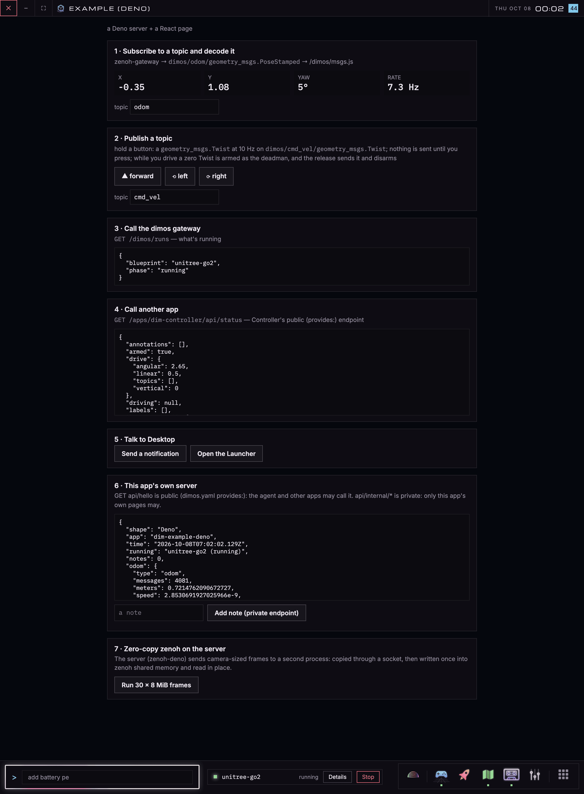
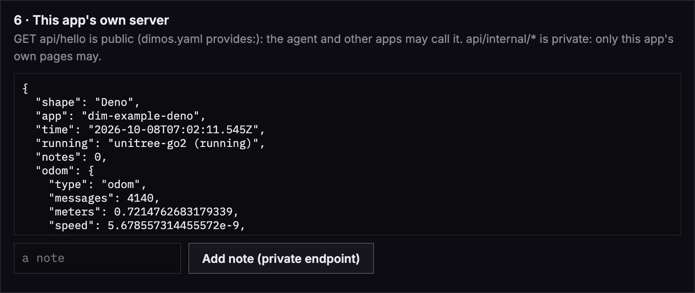
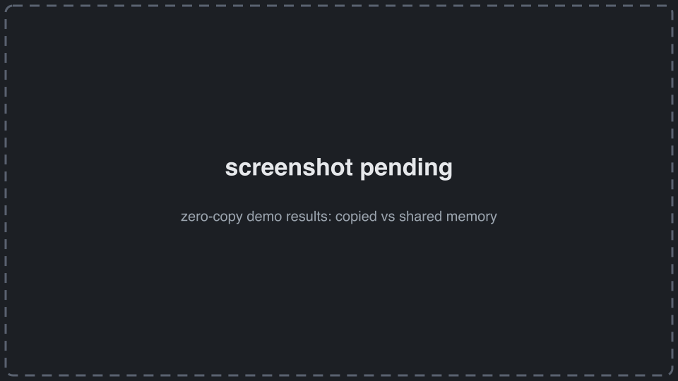

# dim-example-deno

This is an example app for dimos desktop.

# Install

Desktop → App Store → **Install From URL** → `github.com/jeff-hykin/dim-example-deno`

or in the command line:

```sh
dimos-desktop install github.com/jeff-hykin/dim-example-deno
```

# This Stack

React + Vite + Deno + [zenoh-deno](https://github.com/jeff-hykin/zenoh-deno)
- watch/read/write files
- efficiently watch zero-copy zenoh topics
- run background jobs




## 1. Build

Run `nix build .#dimosApp`

## 2. Server reads `DIMOS_APP` for the socket address

`backend/main.ts`:

```ts
const app = JSON.parse(Deno.env.get("DIMOS_APP") ?? "{}") as {
  name?: string;
  socket?: string;
  dataDir?: string;
  desktopUrl?: string;
  zenohConnect?: string;
  zenohPrefix?: string;
};

if (app.socket) {
  Deno.serve({ path: app.socket, transport: "unix" }, serve);
} else {
  // outside Desktop: `deno task serve` serves on a port (open http://localhost:8787/)
  Deno.serve({ port: Number(flag("port") ?? 8787) }, serve);
}
```

## Listen to Topics

`backend/robot.ts` connects to zenoh, decodes `/odom` with `@dimos/msgs`, and keeps a
distance/speed summary.

```ts
const session: Session = await open(new Config(zenohConnect), { zenohVersion: "1.6.2" });
await session.declareSubscriber("dimos/odom/geometry_msgs.PoseStamped", {
  handler: (sample) => {
    const { header, pose: { position } } = PoseStamped.decode(sample.payload().toBytes());
    // ... distance and speed since the server started
  },
});
```

## Backend informing the Frontend

Typically the frontend calls the backend (http request), but when we want to go in the opposite direction (ex: file watcher) we use zenoh-gateway. We put it on `<zenohPrefix>/frontend/<topic>` reaches every open
page through Desktop's zenoh-gateway. 

This allows us to have one connection that is managing bandwidth prioritisation for all backend-to-frontend data. 

```ts
const publisher = await session.declarePublisher(`${zenohPrefix}/frontend/odom`);
const timer = setInterval(() => publisher.put(JSON.stringify(summary)).catch(() => {}), 500);
```

## Public and private endpoints

```ts
if (route === "GET /api/hello") {
  const { launch } = await desktop("GET", "/dimos/runs").catch(() => ({ launch: null }));
  return json({
    shape: "Deno",
    running: launch ? `${launch.blueprint} (${launch.phase})` : null,
    notes: (await readNotes()).length,
    odom: (await robot)?.summary() ?? null,
  });
}
```

```yaml
provides:
  endpoints:
    - method: GET
      path: api/hello
      description: Who this app is, what dimos is running right now, and how many notes it holds
      role: context
    - method: POST
      path: api/notes
      description: Add a note to the app's list (the person gets a notification)
  private:
    - api/internal/*
```



## Zero-copy frames through zenoh shared memory

`backend/zero_copy.ts` sends 8 MiB frames to a second process, copied vs written once into shared
memory and read in place.

```ts
const provider = await ShmProvider.create(frameBytes * 4, { zenohVersion: "1.6.2" });
const frame = await provider.allocAsync(frameBytes);
// a real producer renders the frame straight into frame.bytes()
await publisher.put(frame);
```



## On the page: decoded topics in React

`src/dim.ts` connects (dim-app vendored in `src/dim-app/`); `src/sections/Topics.tsx` subscribes in
an effect, which returns the unsubscribe.

```ts
export function connectDimApp(): DimApp {
  return new DimApp({
    msgDecodeEndpoint: "../../dimos/msgs.js",
    connectOptions: { heartbeatHz: 5, heartbeatMisses: 3 },
  });
}
```

```tsx
useEffect(() => {
  return dim.subscribe<PoseStamped>(topic, (message) => {
    if (message instanceof Uint8Array) {
      return;
    }
    setPose(toPose2d(message));
  }, { type: "geometry_msgs.PoseStamped", delivery: "latest", maxHz: 20 });
}, [dim, topic]);
```

## Look like Desktop in every skin

`src/theme.ts` (copy it as is) follows Desktop's skin, corners and insets:

```tsx
export function App({ dim }: { dim: DimApp }) {
  useDesktopTheme();
  // ...
}
```

## Develop

```sh
deno install
deno task build && deno task serve   # http://localhost:8787 (or `deno task dev` for Vite's hot reload)
deno task check && deno task test && deno fmt && deno lint
dimos-desktop app check .            # dimos.yaml declares everything it calls
```

## Files

- `dimos.yaml`: the contract with Desktop (what it calls, what it offers)
- `flake.nix`: `nix build .#dimosApp`
- `index.html`, `src/`: the page (`src/sections/` is one file per thing it shows)
- `backend/main.ts`: the server; `backend/robot.ts`: its zenoh session; `backend/zero_copy.ts`: the
  zero-copy demo
- `icon.svg`: its icon
